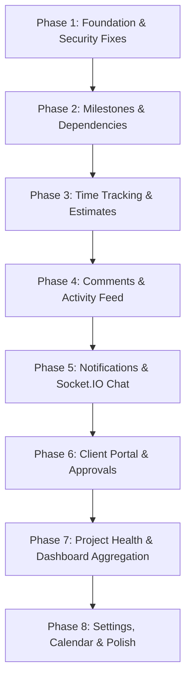

# 📊 Comprehensive Codebase Audit & Implementation Roadmap

> **Project:** Pejimon — Multi-Tenant SaaS Project Management Platform  
> **Reference Plan:** `plan.md` (Stage 1 MVP Architecture)  
> **Date:** August 29, 2026  
> **Status:** Stage 1 Foundation Active (Core CRUD Implemented, Phase-by-Phase Feature Expansion Next)

---

## 1. Executive Summary & Stack Comparison

| Architectural Layer | Specification in `plan.md` | Current Implementation | Status |
| :--- | :--- | :--- | :--- |
| **Backend Framework** | Express 5 + TypeScript (Modular Monolith) | Express 5.2.1 + TypeScript (ESM) | ✅ Fully Aligned |
| **Frontend Framework** | Next.js 16 + TypeScript + App Router | Next.js 16.2.12 + React 19 + TypeScript | ✅ Fully Aligned |
| **Database** | PostgreSQL | PostgreSQL (via `pg` 8.23 + `@prisma/adapter-pg`) | ✅ Fully Aligned |
| **ORM** | Prisma 7 (Production Stable) | Prisma 7.9.1 with Client & Migrations | ✅ Fully Aligned |
| **Authentication** | BetterAuth / Multi-Tenant JWT & Sessions | BetterAuth 1.7.1 + Organization Plugin | ✅ Fully Aligned |
| **Validation** | Zod (Runtime Schema Validation) | Zod 4.4.3 (Server) / Zod 3.25 (Client) | ✅ Fully Aligned |
| **State Management** | TanStack Query or Redux Toolkit | Redux Toolkit 2.12 + RTK Query | ✅ Implemented & Functional |
| **UI & Styling** | Tailwind CSS + shadcn/ui + Radix | Tailwind CSS v4 + shadcn/ui + Radix Primitives | ✅ Fully Aligned |
| **Realtime** | Socket.IO (Chat & Live Notifications) | *Not yet configured* | ⏳ Pending (Phase 5) |
| **File Storage** | S3 Presigned Uploads / Object Storage | Local Multer Uploads (`/uploads`) | ⏳ Pending Upgrade (Phase 8) |

---

## 2. Current Status: What Has Been Done

```
                                  CURRENT STATUS MAP
┌────────────────────────────────────────────────────────────────────────────────────────┐
│ [DATABASE & MODELS]                                                                    │
│  ├── User / Account / Session / Verification (BetterAuth) ................... ✅ DONE  │
│  ├── Organization / Member / OrganizationRole / Invitation .................. ✅ DONE  │
│  ├── Plan / Subscription (Tiered limits & billing) .......................... ✅ DONE  │
│  ├── Team / TeamMember / Project / ProjectTeam / ProjectUser ................ ✅ DONE  │
│  ├── Task / TaskAssignment / TaskDependency ................................. ✅ DONE  │
│  ├── Milestone / Comment / Attachment / TimeEntry ........................... ✅ DONE  │
│  ├── Client / ProjectClient / ClientApproval ................................ ✅ DONE  │
│  ├── Conversation / ConversationMember / Message ............................ ✅ DONE  │
│  ├── Notification / Activity / ProjectTemplate .............................. ✅ DONE  │
│  └── 32 Seed JSON Datasets + Database Seed Pipeline ......................... ✅ DONE  │
├────────────────────────────────────────────────────────────────────────────────────────┤
│ [BACKEND API MODULES]                                                                  │
│  ├── Auth & Custom Session Hook (/api/auth/*) ............................... ✅ DONE  │
│  ├── Organization CRUD (/organizations) ..................................... ✅ DONE  │
│  ├── Project CRUD (/projects) ............................................... ✅ DONE  │
│  ├── Task CRUD with Assignments (/tasks) .................................... ✅ DONE  │
│  ├── Team CRUD with Managers & Members (/teams) ............................. ✅ DONE  │
│  ├── User Directory & Session (/users, /users/me) ............................ ✅ DONE  │
│  └── Subscriptions & Plans (/subscriptions/plans, /subscribe) ................ ✅ DONE  │
├────────────────────────────────────────────────────────────────────────────────────────┤
│ [FRONTEND CLIENT & SHELL]                                                              │
│  ├── Auth Routes (/login, /register) ........................................ ✅ DONE  │
│  ├── Subscription Picker (/subscription) .................................... ✅ DONE  │
│  ├── 4-Step Onboarding Wizard (/onboarding) ................................. ✅ DONE  │
│  ├── Organization Workspace Selector (/select-organization) ................. ✅ DONE  │
│  ├── 5-Layer Route Middleware Pipeline (Auth, Sub, Onboard, Org) ............ ✅ DONE  │
│  ├── Responsive Layout Shell (Collapsible Sidebar + Theme Toggle Navbar) .... ✅ DONE  │
│  ├── Projects Management Page (/projects) ................................... ✅ DONE  │
│  ├── Project Detail Page (/projects/[slug]) with 4 Task Views ............... ✅ DONE  │
│  │    ├── Kanban Board View (Drag-and-drop styled board) .................... ✅ DONE  │
│  │    ├── Task List View .................................................... ✅ DONE  │
│  │    ├── Task Table View ................................................... ✅ DONE  │
│  │    └── Task Timeline View ................................................ ✅ DONE  │
│  ├── Teams Management Page (/teams) ......................................... ✅ DONE  │
│  └── Role Dashboard Previews (/dashboard - Owner, Admin, Member, Client) .... ✅ DONE  │
└────────────────────────────────────────────────────────────────────────────────────────┘
```

---

## 3. Identified Gaps & Technical Debt

Before implementing new feature modules, several security and data isolation gaps need to be corrected:

1. **Hardcoded User IDs:**
   - In `project.controller.ts` line 93: `createdById: "user-1"` is hardcoded instead of extracting `res.locals.session.user.id`.
   - In `task.controller.ts`, authoring falls back to `project.createdById` instead of the session's active user.
2. **Missing Strict Tenant-Isolation Query Filtering:**
   - `project.controller.ts` and `task.controller.ts` execute `findMany` and `findFirst` without strictly appending `where: { organizationId: activeOrgId }`. This creates a vulnerability where projects from Organization A could be fetched by Organization B if the slug is known.
3. **Missing `requireOrganization` Express Middleware:**
   - Express needs a dedicated middleware to extract the active `organizationId` from `res.locals.session` or header `X-Organization-Id` and enforce that the caller is an active member of that tenant before reaching controllers.
4. **Fallback Default Organization Creation:**
   - If `organizationId` is missing, controllers currently create a `"Default Organization"` on the fly. This bypasses the multi-tenant onboarding flow and should return `400 Bad Request` or `403 Forbidden`.

---

## 4. What Is Left To Do (Missing Stage 1 Features)

According to `plan.md` (Sections 10 to 45), the following modules and capabilities remain to be built:

```text
┌───────────────────────────────────────────────────────────────────────────────────┐
│                           MISSING STAGE 1 MODULES                                 │
├──────────────────────────┬────────────────────────────────────────────────────────┤
│ 1. Milestones            │ Progress tracking, milestone CRUD, project milestones  │
│ 2. Task Dependencies     │ Blocked/blocking logic, cycle detection, UI badges     │
│ 3. Time Tracking         │ Live stopwatch timer, manual hour logging, estimations │
│ 4. Comments & Mentions   │ Task discussion threads, nested replies, @mentions     │
│ 5. Activity Log Stream   │ Audit trail for task/project/member events             │
│ 6. In-App Notifications  │ Real-time alerts, unread counts, notification drawer   │
│ 7. Real-Time Chat        │ Socket.IO integration, project chat drawer, messages   │
│ 8. Client Portal         │ External client accounts, deliverables sign-offs       │
│ 9. Project Health Engine │ Aggregated dashboard endpoint & health score metric    │
│ 10. Settings & Calendar  │ Org member management, settings, calendar page         │
└──────────────────────────┴────────────────────────────────────────────────────────┘
```

---

## 5. Ordered Implementation Roadmap

Below is the step-by-step ordered implementation plan grouped into 8 actionable phases:



---

### 🔷 Phase 1: Foundation & Multi-Tenant Security Fixes *(Immediate Priority)*

- [ ] **Task 1.1: Create `requireOrganization` Backend Middleware**
  - **File:** `server/src/middleware/requireOrganization.ts`
  - Read `activeOrganizationId` from `res.locals.session.session.activeOrganizationId` or request header `x-organization-id`.
  - Validate database membership in `prisma.member`.
  - Attach `req.organizationId` to Express Request context.
- [ ] **Task 1.2: Refactor Project, Task, and Team Controllers for Strict Multi-Tenancy**
  - **Files:** `server/src/modules/projects/project.controller.ts`, `server/src/modules/tasks/task.controller.ts`, `server/src/modules/teams/team.controller.ts`
  - Remove hardcoded `"user-1"` and extract authentic user ID from `res.locals.session.user.id`.
  - Enforce `where: { organizationId: req.organizationId }` on all `findMany`, `findFirst`, `update`, `delete` queries.
  - Reject requests without valid active organization instead of creating a `"Default Organization"`.

---

### 🔷 Phase 2: Project Milestones & Task Dependencies

- [ ] **Task 2.1: Milestones Backend API**
  - **Files:** `server/src/modules/milestones/milestone.routes.ts`, `milestone.controller.ts`, `milestone.schema.ts`
  - `GET /projects/:projectSlug/milestones`: List milestones with calculated progress (% of completed tasks).
  - `POST /projects/:projectSlug/milestones`: Create milestone for project.
  - `PUT /milestones/:id`: Update milestone status / due date.
  - `DELETE /milestones/:id`: Delete milestone.
- [ ] **Task 2.2: Task Dependencies Backend API**
  - **Files:** `server/src/modules/dependencies/dependency.routes.ts`, `dependency.controller.ts`
  - `POST /tasks/:taskId/dependencies`: Add dependency (`dependsOnTaskId`).
  - `DELETE /tasks/:taskId/dependencies/:dependencyId`: Remove dependency.
  - Add cycle prevention (Task A cannot depend on Task B if Task B depends on Task A).
  - In `task.controller.ts`, return `isBlocked: boolean` by checking if any prerequisite tasks are incomplete.
- [ ] **Task 2.3: Frontend Milestones & Dependencies UI**
  - **Files:** `client/src/state/api.ts`, `client/src/app/projects/[slug]/page.tsx`, `client/src/components/tasks/TaskModal.tsx`
  - Add RTK Query endpoints for milestones and dependencies.
  - Add Milestone Progress Card and milestone filter above task views on the Project Detail Page.
  - Add Dependency selector and "Blocked by" status indicator in the Task Modal and Kanban cards.

---

### 🔷 Phase 3: Time Tracking & Task Estimates

- [ ] **Task 3.1: Time Tracking Backend API**
  - **Files:** `server/src/modules/timeTracking/timeTracking.routes.ts`, `timeTracking.controller.ts`, `timeTracking.schema.ts`
  - `POST /tasks/:taskId/time-entries`: Start a timer or log a completed duration.
  - `PATCH /time-entries/:id/stop`: Stop an active timer and calculate `durationHours`.
  - `GET /tasks/:taskId/time-entries`: Get task time logs and total logged hours vs estimated hours.
  - `GET /organizations/time-entries`: Get user/team workload breakdown.
- [ ] **Task 3.2: Frontend Timer & Time Logging UI**
  - **Files:** `client/src/components/tasks/TimeTracker.tsx`, `client/src/components/tasks/TaskModal.tsx`
  - Add active stopwatch widget with Start/Stop controls in Task Modal and Navbar.
  - Show "Estimated vs Actual" progress bar on task cards and table view.

---

### 🔷 Phase 4: Collaboration — Comments & Activity Feed

- [ ] **Task 4.1: Task Comments Backend API**
  - **Files:** `server/src/modules/comments/comment.routes.ts`, `comment.controller.ts`, `comment.schema.ts`
  - `GET /tasks/:taskId/comments`: Fetch threaded comments and author profiles.
  - `POST /tasks/:taskId/comments`: Post comment or reply (`parentId`).
  - `DELETE /comments/:id`: Soft-delete comment.
- [ ] **Task 4.2: Activity Logging Service**
  - **Files:** `server/src/modules/activities/activity.service.ts`, `activity.routes.ts`, `activity.controller.ts`
  - Reusable helper `recordActivity({ orgId, projectId, actorId, action, entityType, entityId, metadata })`.
  - Automatically log events: `TASK_CREATED`, `TASK_STATUS_CHANGED`, `TASK_ASSIGNED`, `PROJECT_CREATED`, `MILESTONE_COMPLETED`.
  - `GET /projects/:projectSlug/activities` & `GET /organizations/activities`.
- [ ] **Task 4.3: Comments & Activity Feed UI**
  - **Files:** `client/src/components/tasks/TaskComments.tsx`, `client/src/components/projects/ProjectActivityStream.tsx`
  - Render threaded discussion tab in `TaskModal`.
  - Render live Activity Feed stream in single project page sidebar.

---

### 🔷 Phase 5: Notifications & Real-Time Chat (Socket.IO)

- [ ] **Task 5.1: Notifications Backend Module**
  - **Files:** `server/src/modules/notifications/notification.routes.ts`, `notification.controller.ts`
  - `GET /notifications`: Get authenticated user's notifications.
  - `PATCH /notifications/:id/read`: Mark notification as read.
  - `PATCH /notifications/read-all`: Mark all as read.
- [ ] **Task 5.2: Socket.IO Server Setup**
  - **Files:** `server/src/main.ts`, `server/src/lib/socket.ts`
  - Initialize Socket.IO server with BetterAuth session authentication.
  - Join rooms: `organization:${orgId}` and `project:${projectId}`.
  - Emit real-time events: `message.created`, `notification.received`, `task.updated`.
- [ ] **Task 5.3: Real-Time Chat Backend API**
  - **Files:** `server/src/modules/chat/chat.routes.ts`, `chat.controller.ts`
  - `GET /projects/:projectSlug/conversation`: Get or create project conversation.
  - `GET /conversations/:id/messages`: Paginated message history.
  - `POST /conversations/:id/messages`: Post message and broadcast via Socket.IO.
- [ ] **Task 5.4: Frontend Chat Drawer & Notification Bell**
  - **Files:** `client/src/components/layout/Navbar.tsx`, `client/src/components/chat/ProjectChatDrawer.tsx`
  - Add Notification Bell dropdown with unread badge in Navbar.
  - Add expandable slide-over Project Chat drawer on Project Detail Page.

---

### 🔷 Phase 6: Client Portal & Deliverable Approvals

- [ ] **Task 6.1: Client Accounts & Approvals Backend API**
  - **Files:** `server/src/modules/clients/client.routes.ts`, `client.controller.ts`
  - `GET /clients`: List organization clients.
  - `POST /clients/invite`: Invite external client with restricted project access (`ProjectClient`).
  - `GET /clients/approvals`: List pending sign-off requests.
  - `POST /projects/:projectId/approvals`: Create approval request for client.
  - `PATCH /approvals/:id/respond`: Client approves or requests changes with comments.
- [ ] **Task 6.2: Frontend Client Portal Integration**
  - **Files:** `client/src/components/dashboard/client/ClientDashboard.tsx`, `client/src/app/projects/[slug]/page.tsx`
  - Connect `ClientDashboard` to live approvals and milestone delivery roadmap.
  - Add "Request Client Approval" action button on project deliverables.

---

### 🔷 Phase 7: Project Health Engine & Dashboard Aggregator

- [ ] **Task 7.1: Project Health Calculation Engine**
  - **Files:** `server/src/modules/projects/project.health.ts`, `project.controller.ts`
  - Implement dynamic health score algorithm:
    - Score starts at 100.
    - Penalize overdue tasks (-5 pts each), blocked tasks (-4 pts each), critical priority overdue (-10 pts each).
    - Status categories: `HEALTHY` (80-100), `ATTENTION` (60-79), `AT_RISK` (<60).
  - Implement aggregated endpoint: `GET /projects/:slug/dashboard` returning health score, task stats, workload, upcoming deadlines, and recent activities in a single payload.
- [ ] **Task 7.2: Connect Role Dashboards to Live Aggregated APIs**
  - **Files:** `client/src/components/dashboard/owner/OwnerDashboard.tsx`, `AdminDashboard.tsx`, `MemberDashboard.tsx`
  - Replace mock stat numbers with live data from RTK Query hooks.

---

### 🔷 Phase 8: Organization Settings, Calendar & Production Polish

- [ ] **Task 8.1: Organization Settings Page (`/settings`)**
  - **Files:** `client/src/app/settings/page.tsx`, `client/src/components/settings/*`
  - Member management tab: list members, change roles (`admin`, `member`, `viewer`), invite new members, revoke memberships.
  - Organization profile tab: rename workspace, update logo, view subscription limits.
- [ ] **Task 8.2: Calendar View Page (`/calendar`)**
  - **Files:** `client/src/app/calendar/page.tsx`
  - Monthly and weekly grid aggregating task due dates, milestone deadlines, and team schedules across all active projects.
- [ ] **Task 8.3: Standardized Error Handling & OpenAPI Documentation**
  - Standardize error formatting across all Express routes: `{ success: false, error: { code, message } }`.
  - Add Swagger/OpenAPI documentation (`/api/docs`).

---

## 🎯 Recommended Next Immediate Step

Execute **Phase 1 (Security & Multi-Tenant Scoping Fixes)** first, immediately followed by **Phase 2 (Milestones & Task Dependencies)**. This creates a solid foundation for the remaining collaboration, health engine, and dashboard features.
